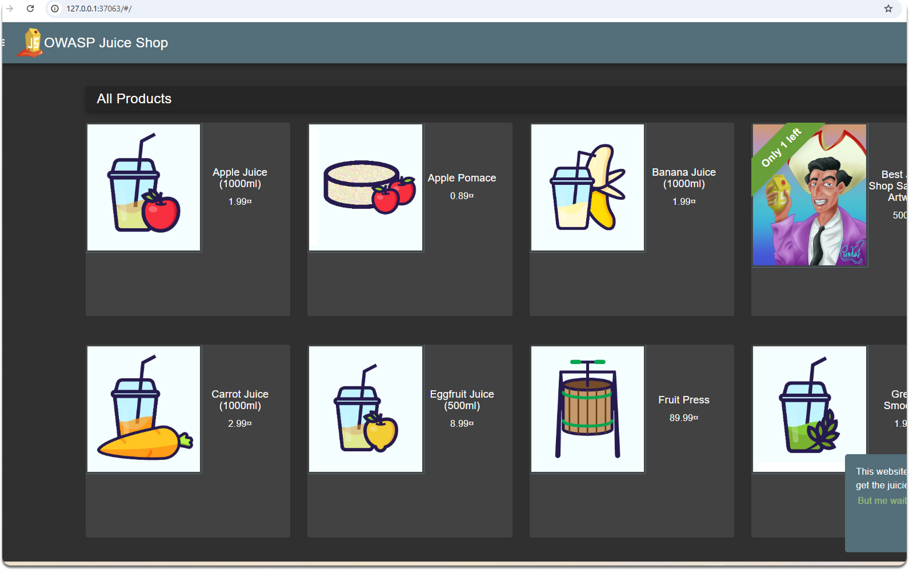
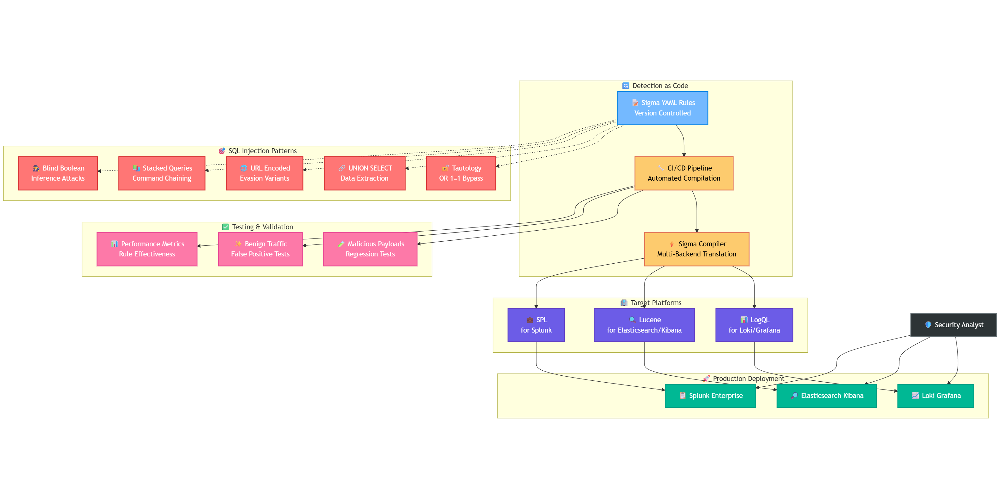

# SQL Injection Detection Lab for Kubernetes

[](https://github.com/topcug/kubernetes-sigma-soc-detection-lab/actions/workflows/ci.yml)


A complete hands-on lab for learning SQL injection exploitation, Kubernetes observability, and detection-as-code.

This repository accompanies a three-part blog series that starts with a vulnerable PHP/MySQL lab, moves the attack surface into Kubernetes with OWASP Juice Shop, and finishes with portable Sigma rules that can compile into Loki, Elasticsearch, and Splunk queries.



## What You'll Build

By the end of this lab, you'll have:

- A vulnerable PHP/MySQL application for testing SQL injection techniques
- OWASP Juice Shop running on Minikube as a realistic target application
- Falco collecting syscall-level container activity
- Zeek parsing HTTP traffic and detecting SQL injection payloads
- Fluent Bit forwarding telemetry into Loki
- Grafana dashboards and queries for investigation
- Sigma detection rules that convert into backend-specific queries
- Regression payloads for validating malicious and benign traffic



## Lab Architecture

```text
┌─────────────────┐    ┌─────────────────┐    ┌─────────────────┐
│   Juice Shop    │    │      Zeek       │    │     Falco       │
│  (Target App)   │────│ (Network Mon.)  │    │ (Syscall Mon.)  │
└─────────────────┘    └─────────────────┘    └─────────────────┘
         │                       │                       │
         └───────────────────────┼───────────────────────┘
                                 │
                    ┌─────────────────┐
                    │   Fluent Bit    │
                    │ (Log Collector) │
                    └─────────────────┘
                                 │
                    ┌─────────────────┐
                    │      Loki       │
                    │ (Log Storage)   │
                    └─────────────────┘
                                 │
                    ┌─────────────────┐
                    │    Grafana      │
                    │ (Visualization) │
                    └─────────────────┘
````

## Prerequisites

* Docker
* Minikube or another Kubernetes cluster
* kubectl
* Helm 3.x
* curl
* Python 3.8+ with pip

## Learning Path

Read the full series first if you want the concepts, methodology, and reasoning behind the lab.

1. [Time, Errors, and Unions: Practical SQL Injection Exploitation and Detection](https://topcug.clarifyintel.com/posts/sql-injection-practical-guide/): Build a controlled PHP/MySQL SQL injection lab and test authentication bypass, UNION-based extraction, error-based leaks, boolean-based inference, and time-based blind enumeration.

2. [Building a Detection-Ready SOC Lab on Kubernetes](https://topcug.clarifyintel.com/posts/soc-detection-lab-kubernetes/): Deploy OWASP Juice Shop on Minikube and build an observable detection pipeline using Falco, Zeek, Fluent Bit, Loki, and Grafana.

3. [SQL Injection Detection with Sigma on Kubernetes](https://topcug.clarifyintel.com/posts/sql-injection-detection-sigma-kubernetes/): Convert lab-tested detection logic into portable Sigma rules and compile them into Loki, Elasticsearch, and Splunk queries.

## Attack Techniques Covered

* Authentication bypass with `OR 1=1` tautologies
* UNION-based injection for extracting data across tables
* Error-based injection using MySQL error output
* Boolean blind injection through true/false response behavior
* Time-based blind injection using delayed database responses
* URL-encoded payload variants
* Comment-based obfuscation with `--`, `#`, and inline SQL comments

## Detection Coverage

* Network-level detection with Zeek HTTP parsing
* Runtime detection with Falco syscall monitoring
* Centralized log collection with Fluent Bit
* Log storage and investigation with Loki and Grafana
* Sigma rules for backend-independent detection logic
* Query generation for Loki, Elasticsearch, and Splunk
* Regression testing with known malicious and benign payloads
* MITRE ATT&CK mapping for analyst context

## Repository Contents

* `juice-shop.yaml` - Kubernetes manifest for OWASP Juice Shop
* `zeek-daemonset.yaml` - Zeek deployment for network inspection
* `detect-sqli.zeek` - Zeek script for SQL injection detection
* `falco-values.yaml` - Falco Helm values for syscall monitoring
* `fluent-bit.yaml` - Fluent Bit configuration for log forwarding
* `parsers-conf` - Parser configuration for Zeek log formats
* `sigma-sqli-detection-pipeline.yaml` - Sigma rule for SQL injection detection
* `requirements.txt` - Python dependencies for Sigma tooling
* `tests/` - Test assets and validation helpers
* `sqli.pcap` - Sample packet capture for traffic analysis

## Quick Start

Clone the repository:

```bash
git clone https://github.com/topcug/kubernetes-sigma-soc-detection-lab.git
cd kubernetes-sigma-soc-detection-lab
```

Start Minikube:

```bash
minikube start
```

Deploy Juice Shop:

```bash
kubectl apply -f juice-shop.yaml
kubectl get pods,svc
```

Deploy Zeek:

```bash
kubectl create configmap zeek-scripts --from-file=detect-sqli.zeek
kubectl apply -f zeek-daemonset.yaml
```

Install Falco:

```bash
helm repo add falcosecurity https://falcosecurity.github.io/charts
helm repo update
helm install falco falcosecurity/falco --values falco-values.yaml
```

Install Fluent Bit and Loki/Grafana following the walkthrough in Part 2.

## Test a SQL Injection Payload

Send a basic tautology payload to Juice Shop:

```bash
curl "http://$(minikube ip):30602/rest/products/search?q=test%27%20OR%201=1--"
```

Query Zeek detections in Grafana through Loki:

```logql
{job="default/zeek"} |~ "DETECTED SQLi"
```

Or use the broader Sigma-generated LogQL pattern from Part 3 to detect raw, encoded, UNION-based, and comment-obfuscated variants.

## Sigma Workflow

Install the required Sigma tooling:

```bash
python3 -m venv venv
source venv/bin/activate
pip install -r requirements.txt
```

Convert the Sigma rule to Loki:

```bash
sigma convert -t loki sigma-sqli-detection-pipeline.yaml
```

Convert to Elasticsearch/Lucene with an ECS Zeek pipeline:

```bash
pip install pysigma-backend-elasticsearch
sigma list pipelines lucene
sigma convert -t lucene -p ecs_zeek_beats sigma-sqli-detection-pipeline.yaml
```

The goal is to keep one detection rule as the source of truth and generate backend-specific queries from it.

## Validation Workflow

Use malicious and benign payload sets to validate the rule before trusting it.

* Malicious payloads should trigger detections.
* Benign search terms should stay silent.
* False positives should be fixed in the Sigma YAML, then recompiled.
* Every rule change should be reviewed, versioned, and tested like code.

This gives you a repeatable detection-as-code workflow instead of one-off dashboard queries.

## Related Blog Posts

These posts are not part of the SQL injection series, but they explain Kubernetes networking concepts that help when reasoning about pod traffic and packet visibility.

* [Pod Birth: veth Pairs, IPAM, and Container Networking](https://topcug.clarifyintel.com/posts/pod-birth-veth-pairs-ipam/)
* [Inside Pod-to-Pod Networking: Intra-Node Traffic in Kindnet](https://topcug.clarifyintel.com/posts/intra-node-pod-traffic/)
* [Atomic ConfigMap Updates in Kubernetes](https://topcug.clarifyintel.com/posts/kubernetes-configmap-atomic-updates/)
* [Canary Deployments Made Easy: A CI/CD Journey with GitHub Actions and Argo CD Rollouts](https://topcug.clarifyintel.com/posts/canary-deployments-cicd-gitops/)

## Detection Methods

* Zeek detects SQL injection patterns in HTTP URI and body data.
* Falco captures suspicious runtime activity inside containers.
* Fluent Bit normalizes and forwards logs.
* Loki stores logs for fast investigation.
* Grafana provides analyst-facing queries and dashboards.
* Sigma keeps detection logic portable across platforms.

## Contributing

Found an issue, false positive, broken deployment step, or additional attack vector? Open an issue or submit a pull request.

This lab is designed as a practical training resource for SQL injection detection, Kubernetes telemetry, and detection-as-code workflows.

## Resources

* [OWASP SQL Injection](https://owasp.org/www-community/attacks/SQL_Injection)
* [OWASP Juice Shop](https://owasp.org/www-project-juice-shop/)
* [Sigma](https://sigmahq.io/)
* [Zeek](https://zeek.org/)
* [Falco](https://falco.org/)
* [Fluent Bit](https://fluentbit.io/)
* [Grafana Loki](https://grafana.com/oss/loki/)

## License

MIT License. Use this lab for training, research, writing detection rules, or building your own Kubernetes security lab.
